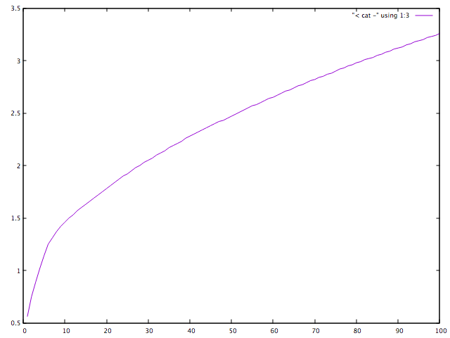

# Analysis of passwords

Some analysis of a cleaned password dump obtained from https://xato.net/today-i-am-releasing-ten-million-passwords-b6278bbe7495.

## Data

```
$ shasum -a 256 10-million-combos.zip
1d52f82e462679f6755dc7565caa193a5c2ce58cd14199b45261d1b6e213e82f  10-million-combos.zip
```

```
$ unzip 10-million-combos.zip
```

```
$ cc -O3 clean.c -o clean && ./clean <10-million-combos.txt > cleaned.txt
Stripping [504245]: alenka_viss	a��
Stripping [528963]: Alexrobat	a��
Stripping [613379]: amiga-3	a��
Stripping [634103]: ananasmmk	a��
Stripping [644008]: and_1.0	a��
Stripping [691211]: angelada94	a��
Stripping [1045417]: BARDAMU3�	boblog
Stripping [1304832]: BlackG�sStar	reggie
Stripping [1770048]: chapylik	a��
Stripping [2269243]: D�yakova	11041960
Stripping [2586104]: don106	er�bxi
Stripping [2866394]: eleonora106	a��
Stripping [3371066]: gaa1976	++-�+�G�P++-+++-�+�G�P1976
Stripping [4429779]: Je����	brad
Stripping [4852678]: karpushinma	a��
Stripping [5463103]: lillebasse_	jordgubbsgr+�t
Stripping [5499082]: little_kity	a��
Stripping [5760615]: malovskyi	a��
Stripping [6053630]: meskhet	a��
Stripping [6060371]: metsdy3	G�
Stripping [6193345]: misty2008	lizzy�00
Stripping [6212957]: mkaraca_78	karacalar-�m
Stripping [6492557]: nastya_soleil	a��
Stripping [6635881]: Night.Haw.KG�+	a1a1a1
Stripping [6863545]: olja.ple	a��
Stripping [6959687]: p640	G�
Stripping [7185864]: ping7	a��
Stripping [7261970]: polyanskova.ekaterina	a��
Stripping [7303821]: prapisa	864�8m
Stripping [8311719]: shibb�+Gi	15306012
Stripping [8939220]: tanya.koz	a��
Stripping [9430749]: undertaker_w	d�+
Stripping [9489283]: vampdanz	a��
```

```
$ time cut -f 2 cleaned.txt | sort | uniq -c | sort -rn > passwords.log
```

### Most common passwords

```
$ head passwords.log
55893 123456
19580 password
13582 12345678
13137 qwerty
11696 123456789
10938 12345
6432 1234
5682 111111
4796 1234567
3927 dragon
```

### cumsum of account coverage by no. of passwords tried

```
$ awk '{ SUM += $1 } { printf "%d %d %.2f%%\n", NR, SUM, SUM * 100 / 10000000 }' passwords.log > cumsum.log
$ head cumsum
1 55893 0.56%
2 75473 0.75%
3 89055 0.89%
4 102192 1.02%
5 113888 1.14%
6 124826 1.25%
7 131258 1.31%
8 136940 1.37%
9 141736 1.42%
10 145663 1.46%
```

```
$ head -100 cumsum.log | gnuplot -p -e 'plot "< cat -" using 1:3 with lines'
```



## References

- https://xa.to/file/10-million-combos.torrent (N.b. I got connection timeout with https, but it worked with http...)
- https://xato.net/today-i-am-releasing-ten-million-passwords-b6278bbe7495
- https://xato.net/ten-million-passwords-faq-3b2752ed3b4c

